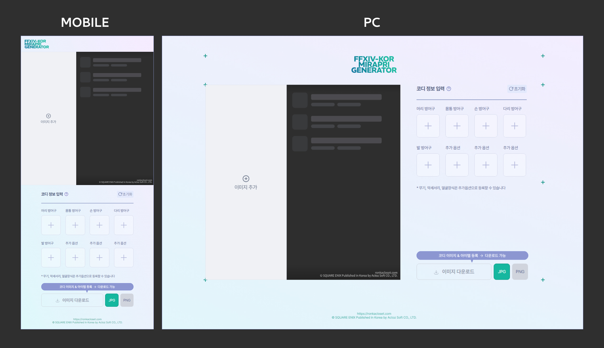
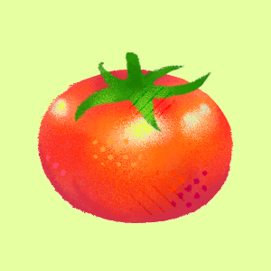
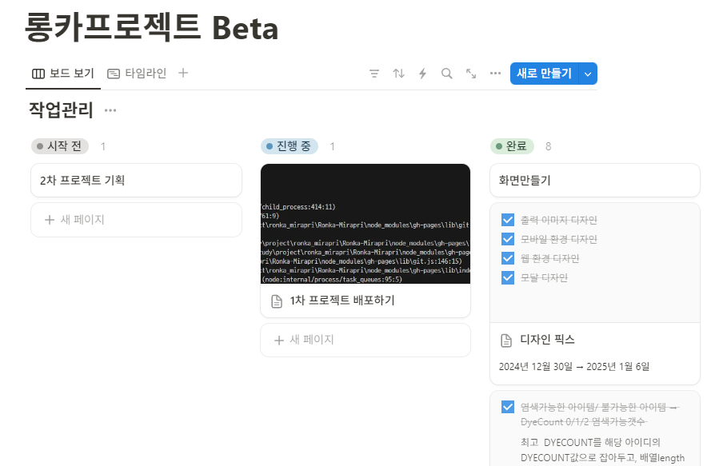
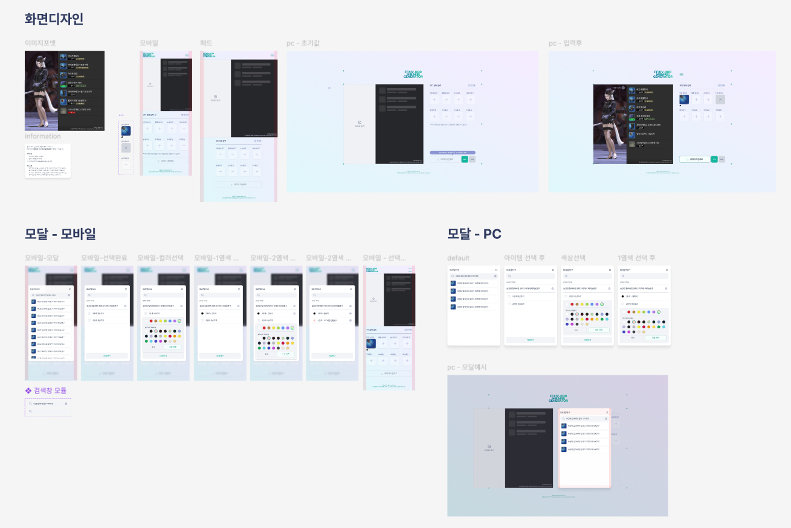

# FFXIV-KOR MIRAPRI GENERATOR

Canvas API를 활용한 파판14 코디 이미지 생성기

## 🎞️ 프로젝트 소개

본 프로젝트는 [롱카의 옷장?](https://ronkacloset.com/) 서브 프로젝트로, 간단하게 <strong>파판14의 코디 이미지를 생성</strong>하고 공유할 수 있습니다.

### 작업기간

2024/12/30 ~ 2024/1/10

## Skills

## 팀원 소개

  
|||
|:---:|:---:|
| [최수진](https://github.com/tomatto0) | [박건](https://github.com/C-dtd) |

 

## Flow chart

## 📙 기획 문서

프로젝트 노션

[🔗 Notion 바로가기](https://ronkacloset.notion.site/Beta-16dd5a9efb39804a8e52dc6c8328e950?pvs=4)

FIGMA

[🔗 FIGMA 바로가기](https://www.figma.com/design/ouijMd8W4P0kQeEtyWoJs0/Ronka-mirapri-%ED%99%94%EB%A9%B4%EA%B3%84%ED%9A%8D%EC%84%9C-%EC%99%B8%EB%B6%80%EA%B3%B5%EA%B0%9C%EC%9A%A9?node-id=0-1&t=rLXAYgQvFAo3t6Jt-1)

